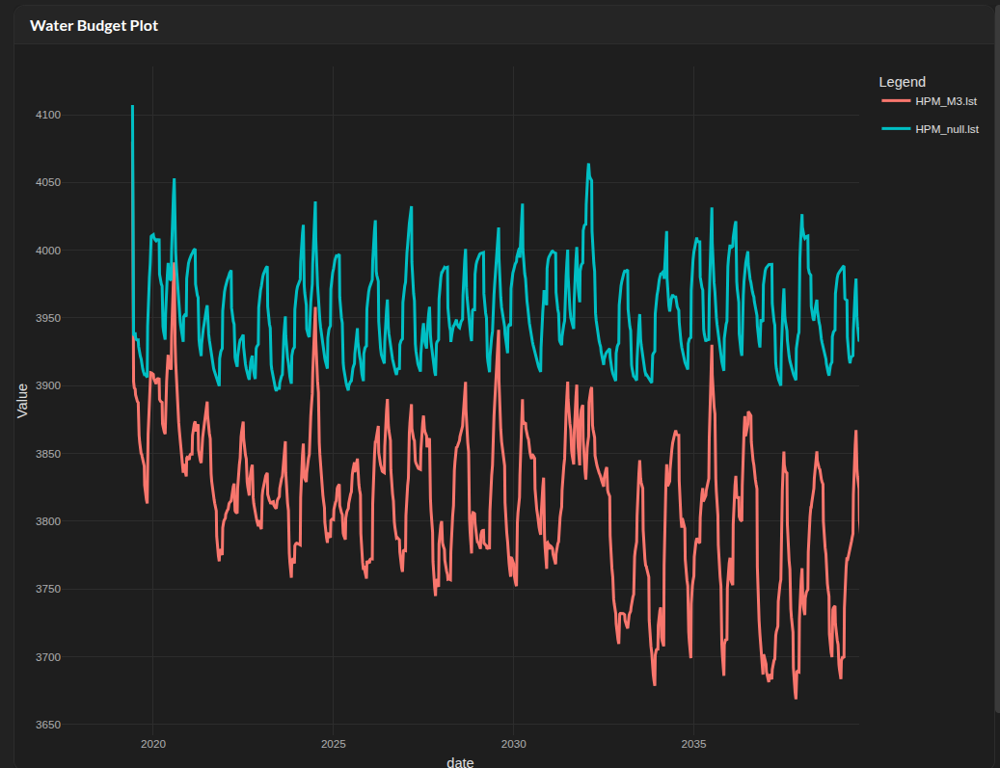
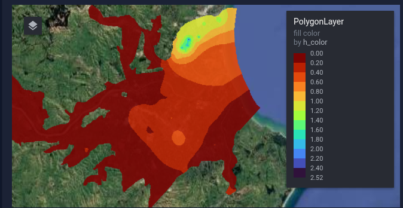

# **Apps Gallery** <span class="beta-badge">BETA</span> {.title}

Our growing suite of web-based tools designed for groundwater modelers and environmental managers. These applications run directly in your browser, enabling instant analysis, visualization, and validation of simulation datasets.

::: {.callout-note appearance="simple"}
These apps are in **beta** and under active development. Found a bug or have a request? Each app links to its GitHub repository where you can open an issue.
:::

```{=html}
<div class="row g-4 mt-2">
  <div class="col-md-6">
    <div class="app-card">
      <a href="https://lst.crayfisher.com" target="_blank" class="app-thumbnail-container">
        
      </a>
      <div class="app-card-body">
        <h4 class="app-card-title">lst reader <span class="beta-badge">BETA</span></h4>
        <div class="app-card-subtitle">MODFLOW listing file reader and visualiser</div>
        <p class="app-card-text">
          Upload, parse, and dynamically analyze water budget calculations, solver convergence performance, and time-step execution details from MODFLOW listing files. Inspired by USGS GW_Chart — an interactive, Shiny-based listing file visualiser.
        </p>
        <a href="https://lst.crayfisher.com" class="btn btn-outline-primary app-btn" target="_blank">Launch App ↗</a>
        <a href="https://github.com/crayfisher/MF_lst" class="btn btn-outline-secondary app-btn" target="_blank"><i class="bi bi-github"></i> Code</a>
      </div>
    </div>
  </div>
  <div class="col-md-6">
    <div class="app-card">
      <a href="https://heads.crayfisher.com" target="_blank" class="app-thumbnail-container">
        
      </a>
      <div class="app-card-body">
        <h4 class="app-card-title">heads visualiser <span class="beta-badge">BETA</span></h4>
        <div class="app-card-subtitle">MODFLOW heads visualiser for mf6, usg, mf2005</div>
        <p class="app-card-text">
          Interactive, web-native Shiny-based 2D visualization of hydraulic heads, drawdown distributions, and hydrographs across different stress periods and layers.
        </p>
        <a href="https://heads.crayfisher.com" class="btn btn-outline-primary app-btn" target="_blank">Launch App ↗</a>
        <a href="https://github.com/crayfisher/MF_heads" class="btn btn-outline-secondary app-btn" target="_blank"><i class="bi bi-github"></i> Code</a>
      </div>
    </div>
  </div>
</div>
```

<p class="text-center text-white-50 mt-4">
  <em>More specialized modeling apps are in active development. This gallery will be continuously expanded in the future.</em>
</p>
